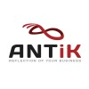

## Bilgi Blockchain
- *Director of Software Department* | Jul 2023 - Present
- 
- Tags: Category 3
- Badges:
  - Badge [blue]
- List Items:
  - After the year we spent together, I was elected by the board and took over the role of director.
  

## Bilgi Blockchain
- *Software Development Team* | Aug 2022 - Jul 2023
- 
- Tags: Category 3
- Badges:
  - Badge [blue]
- List Items:
  - As the software development team, we had the opportunity to improve ourselves in this field by participating in numerous events and workshops throughout the year.

## ANT İnsan Kaynakları
- *Event Assistant* | May 2022 - Dec 2022
- 
- Tags: Category 3
- Badges:
  - Badge [blue]
- List Items:
  - Working on daily jobs e.g. congresses, conferences, meetings, concerts, expos.

## Nike
- *Warehouse Worker* | Aug 2022 - Sep 2022
- 
- Tags: Category 3
- Badges:
  - Badge [blue]
- List Items:
  

## AssisTT 
- *Customer Service Department* | Apr 2022 - May 2022
- 
- Tags: Category 3
- Badges:
  - Badge [blue]
- List Items:
  